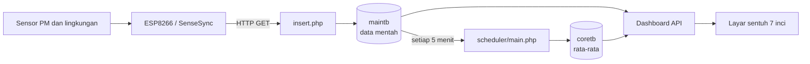

# AQMS Portable

Pemulihan dan modernisasi perangkat pemantau kualitas udara portabel berbasis
Beelink, ESP8266/SenseSync, sensor partikulat, PHP, dan MySQL. Proyek ini
mempertahankan protokol sensor lama, tetapi menjalankan aplikasi pada stack yang
lebih aman dan mudah dipulihkan.


## Status proyek

- Dashboard dirancang untuk layar sentuh 7 inci pada 1024×600 dan 800×480.
- Aplikasi telah diuji dengan PHP 8.3 dan MySQL 8 melalui Docker Compose.
- Pembacaan sensor disimpan lokal; sinkronisasi cloud SenseSync telah dihapus.
- Kredensial database berasal dari environment variable, bukan source code.
- Salinan ini tidak menyertakan backup, dump operasional, atau data perangkat.
- Instalasi Beelink lama belum diganti otomatis oleh repositori ini.

## Fitur

- Pembacaan PM1, PM2.5, PM10, suhu, kelembapan, dan tekanan.
- Status baterai, tegangan, arus, pompa, serta keterlambatan data sensor.
- Grafik partikulat dengan aset Highcharts lokal, tanpa ketergantungan internet.
- Pembaruan dashboard setiap 15 detik tanpa memuat ulang halaman.
- ISPU PM2.5 dan PM10 berdasarkan rerata bergerak 24 jam.
- Label **ISPU Sementara** saat cakupan data belum mencapai 24 jam.
- Endpoint ingest kompatibel dengan firmware ESP8266 lama.
- Agregasi lokal lima menit dari data mentah ke data ringkasan.
- Tombol fullscreen dan tata letak responsif untuk panel lapangan.

## Arsitektur singkat



Tidak ada cabang pengiriman ke server SenseSync. Seluruh pengolahan berjalan di
jaringan lokal.

## Menjalankan secara lokal

Persyaratan:

- Docker Desktop atau Docker Engine
- Docker Compose v2
- Port lokal `18080` tersedia

```bash
git clone https://github.com/rusli3/aqms-portable.git
cd aqms-portable
docker compose up -d --build
```

Buka:

```text
http://127.0.0.1:18080/dashboard/
```

Instalasi baru menggunakan [database/schema.sql](database/schema.sql) tanpa data
contoh. Dashboard akan menampilkan keadaan kosong sampai paket sensor diterima.

Untuk menghentikan stack:

```bash
docker compose down
```

Tambahkan `-v` hanya jika volume database uji memang boleh dihapus.

## Konfigurasi

Variabel aplikasi tersedia pada [.env.example](.env.example):

| Variabel | Kegunaan |
| --- | --- |
| `AQMS_DB_HOST` | Host MySQL |
| `AQMS_DB_PORT` | Port MySQL |
| `AQMS_DB_NAME` | Nama database |
| `AQMS_DB_USER` | Pengguna database |
| `AQMS_DB_PASSWORD` | Kata sandi database |
| `AQMS_DISPLAY_NAME` | Nama unit pada dashboard |
| `AQMS_TIMEZONE` | Zona waktu aplikasi |

Nilai pada `compose.yaml` hanya untuk pengujian lokal. Gunakan secret yang unik
dan batasi akses jaringan sebelum pemasangan lapangan.

## Protokol sensor

Firmware lama mengirim HTTP GET ke `/insert.php` dengan parameter numerik:

```text
pm1, pm25, pm10, temp, humd, ampere, baterai, pompa, volt, press
```

Contoh pengujian lokal:

```bash
curl "http://127.0.0.1:18080/insert.php?pm1=12&pm25=18&pm10=24&temp=29.5&humd=72&ampere=1.2&baterai=85&pompa=1023&volt=12.4&press=1008"
```

Respons berhasil adalah `received`. Paket yang tidak lengkap atau bukan angka
menghasilkan HTTP `400`.

## Scheduler

Scheduler menghitung rata-rata sampel pada lima menit terakhir dan menulisnya
ke `coretb`:

```bash
docker compose exec web php /var/www/html/scheduler/main.php
```

Pada perangkat lapangan, jalankan perintah tersebut setiap lima menit melalui
cron atau systemd timer. Scheduler hanya bekerja lokal dan tidak mengirim data
ke cloud.

## ISPU

Perhitungan menggunakan interpolasi breakpoint PM2.5 dan PM10 pada Permen LHK
P.14/2020. Konsentrasi yang digunakan adalah rerata data hingga 24 jam terakhir.
Jika rentang yang tersedia kurang dari 23 jam, hasil ditandai sebagai sementara
dan dashboard menampilkan jam serta jumlah sampelnya.

Detail rumus, breakpoint, dan batas interpretasi tersedia di
[docs/ISPU.md](docs/ISPU.md). Nilai pada dashboard adalah dukungan operasional;
validitas pelaporan resmi tetap bergantung pada kalibrasi, QA/QC, kelengkapan
data, dan ketentuan instansi berwenang.

## Dokumentasi

- [Arsitektur dan alur data](docs/ARCHITECTURE.md)
- [Pemasangan dan migrasi Beelink](docs/DEPLOYMENT.md)
- [Perhitungan ISPU](docs/ISPU.md)
- [Pemetaan perangkat keras](docs/HARDWARE.md)
- [Keamanan](docs/SECURITY.md)

## Struktur repositori

```text
.
├── app/
│   ├── config/          # koneksi database berbasis environment
│   ├── dashboard/       # UI 7 inci, API JSON, dan perhitungan ISPU
│   ├── display/         # halaman riwayat data warisan
│   ├── insert.php       # endpoint data sensor
│   └── scheduler/       # agregasi lokal lima menit
├── database/schema.sql  # skema publik tanpa data operasional
├── docs/                # dokumentasi teknis
├── compose.yaml
└── Dockerfile
```

## Privasi dan backup

Jangan commit dump database, image SSD, file `.env`, kunci SSH, ID AnyDesk,
alamat tunnel, atau log yang mengandung informasi jaringan. `.gitignore` telah
disiapkan untuk mencegah dump pemulihan utama ikut terunggah.

## Lisensi

Belum ada lisensi open-source yang ditetapkan. Seluruh hak tetap pada pemilik
repositori sampai berkas lisensi ditambahkan.
