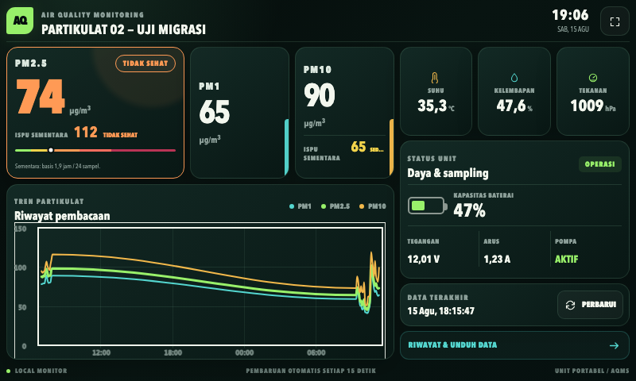
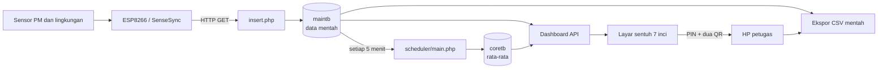

# AQMS Portable

Pemulihan dan modernisasi perangkat pemantau kualitas udara portabel berbasis
Beelink, ESP8266/SenseSync, sensor partikulat, PHP, dan MySQL. Proyek ini
mempertahankan protokol sensor lama, tetapi menjalankan aplikasi pada stack yang
lebih aman dan mudah dipulihkan.



## Status proyek

- Dashboard dirancang untuk layar sentuh 7 inci pada 1024×600 dan 800×480.
- Aplikasi menggunakan PHP 8.3.32 dan MySQL 8.4.11 dengan image/digest terkunci.
- Pembacaan sensor disimpan lokal; sinkronisasi cloud SenseSync telah dihapus.
- Database memakai named volume `aqms_database` dan bertahan setelah `docker compose down`.
- Kredensial database berasal dari environment variable, bukan source code.
- Salinan ini tidak menyertakan backup, dump operasional, atau data perangkat.
- Migrasi referensi ke Ubuntu Server 24.04 LTS, Docker Compose, jaringan sensor
  terisolasi, dan kiosk HDMI telah berhasil divalidasi; pemasangan tetap perlu
  dilakukan mengikuti panduan restore karena repositori tidak mengubah host
  secara otomatis.

## Fitur

- Pembacaan PM1, PM2.5, PM10, suhu, kelembapan, dan tekanan.
- Status baterai, tegangan, arus, pompa, serta keterlambatan data sensor.
- Grafik partikulat memakai Chart.js 4.5.1 berlisensi MIT, disimpan lokal.
- Pembaruan dashboard setiap 15 detik tanpa memuat ulang halaman.
- ISPU PM2.5 dan PM10 berdasarkan rerata bergerak 24 jam.
- Label **ISPU Sementara** saat cakupan data belum mencapai 24 jam.
- Endpoint ingest kompatibel dengan jalur lama `/partikulat/insert.php`, dibatasi CIDR,
  laju kirim, nama parameter, dan rentang nilai; token dapat diaktifkan.
- Agregasi lokal lima menit dari data mentah ke data ringkasan.
- Scheduler berjalan otomatis sebagai service dan mencegah bucket duplikat.
- Tata letak responsif untuk panel lapangan dalam mode kiosk layar penuh.
- Menu reboot/shutdown dengan keypad PIN, pembatasan percobaan, token sesi, dan
  broker systemd host yang hanya menerima dua tindakan daya terverifikasi.
- Startup kiosk tahan terhadap Ethernet yang tidak terpasang: boot tidak menunggu
  kabel LAN dan display otomatis dimuat ulang setelah aplikasi lokal sehat.
- Unduh data mentah melalui HP dengan alur PIN, QR Wi-Fi, QR akses sekali pakai,
  pilihan periode atau seluruh data, dan ekspor CSV seluruh parameter sensor.

## Arsitektur singkat



Tidak ada cabang pengiriman ke server SenseSync. Seluruh pengolahan berjalan di
jaringan lokal.

## Menjalankan secara lokal

Persyaratan:

- Docker Desktop atau Docker Engine
- Docker Compose v2
- Port lokal `18080` tersedia

```bash
git clone https://github.com/rusli3/aqms-portable.git
cd aqms-portable
cp .env.example .env
# ganti kedua password contoh di .env
docker compose up -d --build
```

Buka:

```text
http://127.0.0.1:18080/dashboard/
```

Instalasi baru menggunakan [database/schema.sql](database/schema.sql) tanpa data
contoh. Dashboard akan menampilkan keadaan kosong sampai paket sensor diterima.

Untuk menghentikan stack:

```bash
docker compose down
```

Data tetap tersimpan pada named volume. Jangan menambahkan `-v` kecuali seluruh
database memang sengaja akan dihapus dan backup sudah diverifikasi.

Produksi menggunakan override yang mewajibkan kredensial dan allowlist sensor:

```bash
cp .env.example .env
# edit .env, kemudian:
docker compose -f compose.yaml -f compose.production.yaml up -d --build
```

## Konfigurasi

Variabel aplikasi tersedia pada [.env.example](.env.example):

| Variabel | Kegunaan |
| --- | --- |
| `AQMS_DB_HOST` | Host MySQL |
| `AQMS_DB_PORT` | Port MySQL |
| `AQMS_DB_NAME` | Nama database |
| `AQMS_DB_USER` | Pengguna database |
| `AQMS_DB_PASSWORD` | Kata sandi database |
| `AQMS_DISPLAY_NAME` | Nama unit pada dashboard |
| `AQMS_ORGANIZATION_NAME` | Nama instansi pada header dashboard |
| `AQMS_TIMEZONE` | Zona waktu aplikasi |
| `AQMS_HTTP_BIND` / `AQMS_HTTP_PORT` | Alamat dan port publik web |
| `AQMS_INGEST_ALLOWED_CIDRS` | IP/CIDR yang boleh mengirim data |
| `AQMS_INGEST_TOKEN` | Token opsional bila firmware mendukungnya |
| `AQMS_INGEST_MIN_INTERVAL_SECONDS` | Jarak minimum antarpaket |
| `AQMS_ADMIN_PIN_HASH` | Hash PIN untuk kontrol daya dan akses data |
| `AQMS_WIFI_SSID` | SSID jaringan lokal yang dimasukkan ke QR Wi-Fi |
| `AQMS_WIFI_PSK` | PSK rahasia jaringan lokal; hanya disimpan di `.env` |
| `AQMS_WIFI_HIDDEN` | Menandai SSID tersembunyi pada QR Wi-Fi |
| `AQMS_DATA_URL` | URL lokal yang dimasukkan ke QR halaman data |

Compose menolak start bila kedua password belum diisi. Gunakan secret yang unik
dan batasi akses jaringan sebelum pemasangan lapangan; jangan memakai nilai
placeholder dari `.env.example`.

## Unduh data melalui HP

Tekan **Akses Data** pada dashboard, masukkan PIN admin, lalu:

1. pindai QR pertama untuk terhubung ke Wi-Fi `PARTIKULAT02`;
2. pindai QR kedua untuk membuka halaman data;
3. pilih rentang tanggal atau **Semua Data**;
4. tekan **Unduh CSV**.

QR kedua memakai token acak sekali pakai yang berlaku 10 menit. Setelah dipindai,
HP memperoleh sesi unduh selama 60 menit dan token langsung dihapus. Ekspor
mengambil data mentah dari `maintb`, bukan data rata-rata `coretb`, dan memuat
kolom waktu, PM1, PM2.5, PM10, suhu, kelembapan, arus, baterai, pompa, tegangan,
serta tekanan. QR dibuat lokal sehingga fitur tetap bekerja tanpa internet.

## Protokol sensor

Firmware lama dapat mengirim HTTP GET ke `/insert.php` atau jalur kompatibilitas
`/partikulat/insert.php` dengan parameter numerik:

```text
pm1, pm25, pm10, temp, humd, ampere, baterai, pompa, volt, press
```

Contoh pengujian lokal:

```bash
curl "http://127.0.0.1:18080/insert.php?pm1=12&pm25=18&pm10=24&temp=29.5&humd=72&ampere=1.2&baterai=85&pompa=1023&volt=12.4&press=1008"
```

Respons berhasil adalah `received`. Paket invalid ditolak dengan HTTP `400/422`,
sumber di luar allowlist dengan `403`, dan paket terlalu cepat dengan `429`.

## Scheduler

Service `scheduler` menghitung rata-rata bucket lima menit lengkap dan menulisnya
ke `coretb` secara idempoten. Eksekusi manual untuk diagnosis:

```bash
docker compose exec web php /var/www/html/scheduler/main.php
```

Tidak diperlukan cron host. Scheduler hanya bekerja lokal dan tidak mengirim
data ke cloud.

## ISPU

Perhitungan menggunakan interpolasi breakpoint PM2.5 dan PM10 pada Permen LHK
P.14/2020. Konsentrasi yang digunakan adalah rerata data hingga 24 jam terakhir.
Status 24 jam hanya diberikan bila rentang sedikitnya 23 jam 45 menit, tersedia
minimal 260 dari 289 titik lima-menit, dan tidak ada jeda lebih dari 15 menit.
Selain itu hasil ditandai sementara dan dashboard menampilkan cakupan serta jeda.

Detail rumus, breakpoint, dan batas interpretasi tersedia di
[docs/ISPU.md](docs/ISPU.md). Nilai pada dashboard adalah dukungan operasional;
validitas pelaporan resmi tetap bergantung pada kalibrasi, QA/QC, kelengkapan
data, dan ketentuan instansi berwenang.

## Dokumentasi

- [Arsitektur dan alur data](docs/ARCHITECTURE.md)
- [Pemasangan dan migrasi Beelink](docs/DEPLOYMENT.md)
- [Panduan restore pada Ubuntu Server 24.04 LTS](docs/RESTORE-UBUNTU-24.04.md)
- [Perhitungan ISPU](docs/ISPU.md)
- [Pemetaan perangkat keras](docs/HARDWARE.md)
- [Keamanan](docs/SECURITY.md)
- [Keamanan image container](docs/CONTAINER_SECURITY.md)
- [Kontrol reboot dan shutdown](docs/POWER-CONTROL.md)
- [Akses dan unduh data melalui HP](docs/DATA-ACCESS.md)

## Backup dan pemulihan

```bash
scripts/backup.sh backups/aqms-$(date +%F).sql.gz
scripts/restore.sh backups/aqms-2026-08-15.sql.gz --confirm-import
```

Backup tidak menimpa berkas yang sudah ada dan diverifikasi dengan `gzip -t`.
Uji restore pada stack terpisah sebelum mengandalkannya di lapangan.

## Struktur repositori

```text
.
├── app/
│   ├── config/          # koneksi database berbasis environment
│   ├── dashboard/       # UI 7 inci, API JSON, dan perhitungan ISPU
│   ├── display/         # halaman HP dan ekspor CSV data mentah
│   ├── insert.php       # endpoint data sensor
│   └── scheduler/       # agregasi lokal lima menit
├── database/schema.sql  # skema publik tanpa data operasional
├── scripts/             # backup dan restore terverifikasi
├── tests/               # unit test ISPU dan integration test
├── docs/                # dokumentasi teknis
├── compose.production.yaml
├── Dockerfile.database
├── compose.yaml
└── Dockerfile
```

## Privasi dan backup

Jangan commit dump database, image SSD, file `.env`, kunci SSH, ID AnyDesk,
alamat tunnel, atau log yang mengandung informasi jaringan. `.gitignore` telah
disiapkan untuk mencegah dump pemulihan utama ikut terunggah.

## Lisensi

Proyek utama belum memiliki lisensi open-source. Dependensi chart dan pembuat QR
berlisensi MIT; rincian dan checksum tersedia di
[THIRD_PARTY_NOTICES.md](THIRD_PARTY_NOTICES.md), dengan salinan lisensi vendor
di direktori aset.
